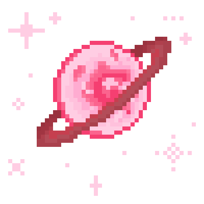

# sample-websocket

***These instructions display to you how to create a tic-tac-toe game in javascript using socket.io

STEP1;

**Create a directory with files index.html index.js and style.css
From cmd:
\user> mkdir <NameYouChoose>
*use the make directory command "mkdir" followed by a name to create a directory

\user cd <NameYouChoose>
*use the change directory command "cd" to move into the directory you created

\user\<NameYouChoose> echo >. index.html index.js style.css
*use echo >. to echo a period into each file 

\user\<NameYouChoose> npm init
*create package.json file

**Install dependencies
From cmd within directory:
\user\<NameYouChoose> code .
*this command will open Visual Studio Code

From VScode:
Press Ctrl + ` to open terminal

From VScode Terminal:
\user\<NameYouChoose> npm i express http nodemon socket.io
*install these four dependencies

STEP 2;

**Index.js
const express = require("express")

const app = express()

const path = require("path")

const http = require("http")

const {Server} = require("socket.io")

const port = 3000;
//port for the app to listen on

const server=http.createServer(app)
//wrapping express server in http server

const io= new Server(server)
//wrapping http server variable "server" in an io server

app.use(express.static(path.resolve("")))
//use app.use to mount the express.static middleware function with an empty path

app.get("/", (req, res)=> {
    return res.sendFile("index.html")
})
//route an http GET request to index.html

server.listen(port, () => {
    console.log(`Port connected on ${port}`)
})

STEP 3;

**Index.html
<!DOCTYPE html>
<html lang="en">
<head>
    <meta charset="UTF-8">
    <meta name="viewport" content="width=device-width, initial-scale=1.0">
    <title>Document</title>
    <link rel="stylesheet" href="style.css" class="rel">
</head>
<body>
    <h1 id="logo">Tic-Tac-Toe</h1>
    

    	
Enter your name

    	<input id="name" type="text" placeholder="Name" name="name" autocomplete="off">
    

	<button id="find">Search for a player</button>
    

    	
You: 

    	
Opponent: 

    	

	
You are 

    
  
    

        <h3 id="loadHeading">Searching For Players</h3>
        
    

    

        

            <button id="button1" class="btn btn1"></button>
            <button id="button2" class="btn btn2"></button>
            <button id="button3" class="btn btn3"></button>
            <button id="button4" class="btn btn4"></button>
            <button id="button5" class="btn btn5"></button>
            <button id="button6" class="btn btn6"></button>
            <button id="button7" class="btn btn7"></button>
            <button id="button8" class="btn btn8"></button>
            <button id="button9" class="btn btn9"></button>
        

    
 
</body>
</html> 
STEP 5;

